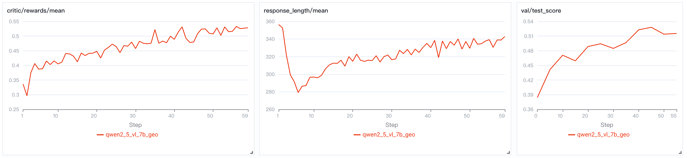
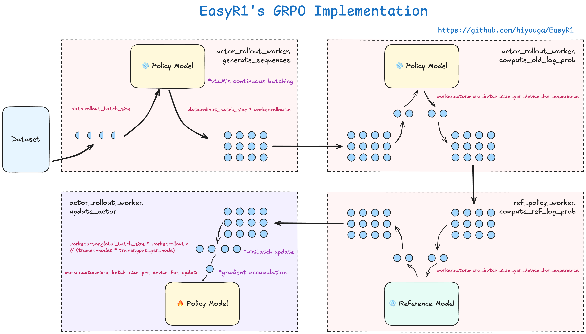

# EasyR1: An Efficient, Scalable, Multi-Modality RL Training Framework

[](https://github.com/hiyouga/EasyR1/stargazers)
[](https://twitter.com/llamafactory_ai)

This project is a clean fork of the original [veRL](https://github.com/volcengine/verl) project to support vision language models, we thank all the authors for providing such a high-performance RL training framework.

EasyR1 is efficient and scalable due to the design of **[HybirdEngine](https://arxiv.org/abs/2409.19256)** and the latest release of **[vLLM](https://github.com/vllm-project/vllm)**'s SPMD mode.

## Features

- Supported models
  - Llama3/Qwen2/Qwen2.5 language models
  - Qwen2/Qwen2.5-VL vision language models
  - DeepSeek-R1 distill models

- Supported algorithms
  - GRPO
  - Reinforce++
  - Remax
  - RLOO

- Supported datasets
  - Any text, vision-text dataset in a [specific format](#custom-dataset)

- Supported tricks
  - Padding-free training
  - Resuming from checkpoint
  - Wandb & SwanLab tracking

## Requirements

### Software Requirements

- Python 3.9+
- transformers>=4.49.0
- flash-attn>=2.4.3
- vllm>=0.7.3

We provide a [Dockerfile](Dockerfile) to easily build environments.

We recommend using the [pre-built docker image](https://hub.docker.com/r/hiyouga/verl) in EasyR1.

```bash
docker pull hiyouga/verl:ngc-th2.5.1-cu120-vllm0.7.4-hotfix
```

### Hardware Requirements

\* *estimated*

| Method                   | Bits |  1.5B  |   3B   |   7B   |
| ------------------------ | ---- | ------ | ------ | ------ |
| GRPO Full Fine-Tuning    |  AMP | 2*24GB | 4*40GB | 8*40GB |

> [!NOTE]
> We are working hard to reduce the VRAM in RL training, LoRA support will be integrated in next updates.

## Tutorial: Run Qwen2.5-VL GRPO on [Geometry3K](https://huggingface.co/datasets/hiyouga/geometry3k) Dataset in Just 3 Steps



### Installation

```bash
git clone https://github.com/hiyouga/EasyR1.git
cd EasyR1
pip install -e .
```

### GRPO Training

```bash
bash examples/qwen2_5_vl_7b_geo3k.sh
```

### Merge Checkpoint in Hugging Face Format

```bash
python3 scripts/model_merger.py --local_dir path_to_your_last_actor_checkpoint
```

> [!TIP]
> If you encounter issues with connecting to Hugging Face, consider using `export HF_ENDPOINT=https://hf-mirror.com`.
>
> If you want to use SwanLab logger, consider using `bash examples/qwen2_5_vl_7b_geo3k_swanlab.sh`.

## Custom Dataset

Please refer to the example datasets to prepare your own dataset.

- Text dataset: https://huggingface.co/datasets/hiyouga/math12k
- Vision-text dataset: https://huggingface.co/datasets/hiyouga/geometry3k

> [!TIP]
> EasyR1 already supports multi-image dataset.

## How to Understand GRPO in EasyR1



- To learn about the GRPO algorithm, you can refer to [Hugging Face's blog](https://huggingface.co/docs/trl/v0.15.2/en/grpo_trainer).
- Different from TRL's GRPO trainer, our trainer supports mini-batch update as described in the [original PPO paper](https://arxiv.org/abs/1707.06347).

## How to Run 70B+ Model in Multi-node Environment

Please see the **[veRL's official doc](https://verl.readthedocs.io/en/latest/start/multinode.html)** for multi-node training and Ray debugger.

## Other Baselines

We also reproduced the following two baselines of the [R1-V](https://github.com/deep-agent/R1-V) project.
- [CLEVR-70k-Counting](examples/baselines/qwen2_5_vl_3b_clevr.sh): Train the Qwen2.5-VL-3B-Instruct model on counting problem.
- [GeoQA-8k](examples/baselines/qwen2_5_vl_3b_geoqa8k.sh): Train the Qwen2.5-VL-3B-Instruct model on GeoQA problem.

## Awesome Work using EasyR1

- **MMR1**: Advancing the Frontiers of Multimodal Reasoning. [![[code]](https://img.shields.io/github/stars/LengSicong/MMR1)](https://github.com/LengSicong/MMR1)
- **Vision-R1**: Incentivizing Reasoning Capability in Multimodal Large Language Models. [![[code]](https://img.shields.io/github/stars/Osilly/Vision-R1)](https://github.com/Osilly/Vision-R1) [![[arxiv]](https://img.shields.io/badge/arxiv-2503.06749-blue)](https://arxiv.org/abs/2503.06749)
- **Seg-Zero**: Reasoning-Chain Guided Segmentation via Cognitive Reinforcement. [![[code]](https://img.shields.io/github/stars/dvlab-research/Seg-Zero)](https://github.com/dvlab-research/Seg-Zero) [![[arxiv]](https://img.shields.io/badge/arxiv-2503.06520-blue)](https://arxiv.org/abs/2503.06520)
- **MetaSpatial**: Reinforcing 3D Spatial Reasoning in VLMs for the Metaverse. [![[code]](https://img.shields.io/github/stars/PzySeere/MetaSpatial)](https://github.com/PzySeere/MetaSpatial)

## TODO

- Support LoRA (high priority).
- Support ulysses parallelism for VLMs (middle priority).
- Support more VLM architectures.

> [!NOTE]
> We will not provide scripts for supervised fine-tuning and inference in this project. If you have such requirements, we recommend using [LLaMA-Factory](https://github.com/hiyouga/LLaMA-Factory).

### Known bugs

These features are temporarily disabled for now, we plan to fix them one-by-one in the future updates.

- Vision language models are not compatible with ulysses parallelism yet.

## Discussion Group

👋 Join our [WeChat group](assets/wechat.jpg).

## Citation

Core contributors: [Yaowei Zheng](https://github.com/hiyouga), [Junting Lu](https://github.com/AL-377), [Shenzhi Wang](https://github.com/Shenzhi-Wang), [Zhangchi Feng](https://github.com/BUAADreamer), [Dongdong Kuang](https://github.com/Kuangdd01) and Yuwen Xiong

We also thank Guangming Sheng and Chi Zhang for helpful discussions.

```bibtex
@misc{zheng2025easyr1,
  title        = {EasyR1: An Efficient, Scalable, Multi-Modality RL Training Framework},
  author       = {Yaowei Zheng, Junting Lu, Shenzhi Wang, Zhangchi Feng, Dongdong Kuang, Yuwen Xiong},
  howpublished = {\url{https://github.com/hiyouga/EasyR1}},
  year         = {2025}
}
```

We recommend to also cite the original work.

```bibtex
@article{sheng2024hybridflow,
  title   = {HybridFlow: A Flexible and Efficient RLHF Framework},
  author  = {Guangming Sheng and Chi Zhang and Zilingfeng Ye and Xibin Wu and Wang Zhang and Ru Zhang and Yanghua Peng and Haibin Lin and Chuan Wu},
  year    = {2024},
  journal = {arXiv preprint arXiv: 2409.19256}
}
```
