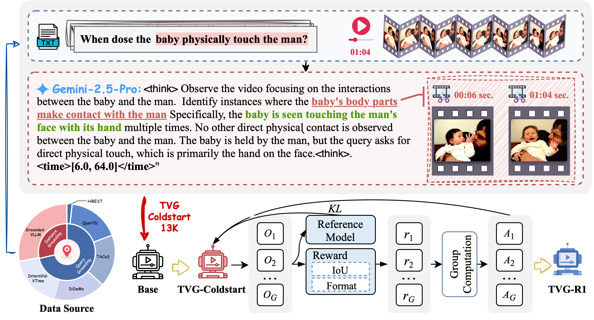

<h2 align="center">Datasets and Recipes for Temporal Video Grounding via
Reinforcement Learning</h2>

<p align="center">
  <a href="https://arxiv.org/abs/2507.18100" target="_blank"></a>
  <a href="https://huggingface.co/collections/RuizheChen/tvg-r1-68820771aef4c59bad76aebf" target="_blank"></a>
  <a href="https://huggingface.co/datasets/RuizheChen/TVG_processed_data" target="_blank"></a>
</p>


<p align="center">
  Ruizhe Chen, Zhiting Fan, Tianze Luo, Heqing Zou, Zhaopeng Feng, Guiyang Xie, Hansheng Zhang, Zhuochen Wang, Zuozhu Liu, Huaijian Zhang 
  <p align="center">Bytedance, Zhejiang University</p>
</p>


> **TL;DR:** This repository presents datasets and recipes to enhance temporal grounding and reasoning capabilities in large vision-language models (LVLMs) for video temporal grounding tasks.


<p align="center"></p>

##  Acknowledgement

Our codes and repository are built on [EasyR1](https://github.com/hiyouga/EasyR1) and [VideoMind](https://github.com/yeliudev/VideoMind). Thanks for their awesome work!

## 📦 TVG-Cold-Start Dataset

### Our Raw Annotations

We release full 56K Chain-of-Thought temporal video grounding annotation by Gemini-2.5-Pro, which can be accessed by [TVG_raw_annotation](https://huggingface.co/datasets/RuizheChen/TVG_raw_annotation).

| Task                                         | # Original Samples | Source Datasets                                                                                                  |
|----------------------------------------------|-------------------|------------------------------------------------------------------------------------------------------------------|
| Instance Grounding <br/>(Moment Retrieval)   | 40K               | HiREST (4K),<br/>QuerYD (33K),<br/>TACoS (10K),<br/>DiDeMo (33K),<br/>InternVid-VTime (54K)   |
| Query Grounding                             | 16K               | Grounded-VLLM (16K)                                                                                          |
| **Total**                                   | **56K**           | **56K**                                                                                                                 |


### Dataset Files

The processed Cold-Start and RL datasets can be accessed by [TVG_processed_annotation](https://huggingface.co/datasets/RuizheChen/TVG_processed_data).


### Raw Videos
Raw videos of TVG-Cold-Start Dataset can be downloaded from [VideoMind](https://huggingface.co/datasets/yeliudev/VideoMind-Dataset) and [Grounded-VideoLLM](https://huggingface.co/datasets/WHB139426/Grounded-VideoLLM).
Here we provide the script for downloading and preprocessing data.

```shell
bash Download_raw_videos.sh
```

The list of source datasets is shown below.

| Dataset | Source | Processed (Recommended) |
|-|:-:|:-:|
| DiDeMo | [Link](https://github.com/LisaAnne/LocalizingMoments/) | [`didemo`](https://huggingface.co/datasets/yeliudev/VideoMind-Dataset/tree/main/didemo) |
| TACoS | [Link](https://www.mpi-inf.mpg.de/departments/computer-vision-and-machine-learning/research/vision-and-language/tacos-multi-level-corpus) | [`tacos`](https://huggingface.co/datasets/yeliudev/VideoMind-Dataset/tree/main/tacos) |
| QuerYD | [Link](https://www.robots.ox.ac.uk/~vgg/data/queryd/) | [`queryd`](https://huggingface.co/datasets/yeliudev/VideoMind-Dataset/tree/main/queryd) |
| HiREST (Grounding) | [Link](https://github.com/j-min/HiREST) | [`hirest`](https://huggingface.co/datasets/yeliudev/VideoMind-Dataset/tree/main/hirest) |
| HiREST (Step Captioning) | [Link](https://github.com/j-min/HiREST) | [`hirest`](https://huggingface.co/datasets/yeliudev/VideoMind-Dataset/tree/main/hirest) |
| InternVid-VTime | [Link](https://github.com/OpenGVLab/InternVideo/tree/main/Data/InternVid) | [`internvid_vtime`](https://huggingface.co/datasets/yeliudev/VideoMind-Dataset/tree/main/internvid_vtime) |
| Grounded-VideoLLM | [Link](https://huggingface.co/datasets/WHB139426/Grounded-VideoLLM) | [`Grounded-VideoLLM`](https://huggingface.co/datasets/WHB139426/Grounded-VideoLLM) |

## 🚀 Training

### Installation
```shell
bash init_Easy_R1.sh
```

### GRPO Training
```shell
cd EasyR1
bash example/TVG_R1.sh
```
More training settings and details can be referred to [EasyR1](https://github.com/hiyouga/EasyR1).

## Evaluation

#### Benchmarks

Raw videos of TVG-Cold-Start Dataset can be downloaded from [VideoMind](https://huggingface.co/datasets/yeliudev/VideoMind-Dataset) and [Grounded-VideoLLM](https://huggingface.co/datasets/WHB139426/Grounded-VideoLLM).
Here we provide the script for downloading and preprocessing data.

```shell
bash Download_evaluation_raw_videos.sh
```

The list of benchmarks is shown below.

| Dataset | Task | Source | Processed (Recommended) |
|-|:-:|:-:|:-:|
| ReXTime | Grounded VideoQA | [Link](https://github.com/ReXTime/ReXTime) | [`rextime`](https://huggingface.co/datasets/yeliudev/VideoMind-Dataset/tree/main/rextime), [`activitynet`](https://huggingface.co/datasets/yeliudev/VideoMind-Dataset/tree/main/activitynet), [`qvhighlights`](https://huggingface.co/datasets/yeliudev/VideoMind-Dataset/tree/main/qvhighlights) |
| NExT-GQA | Grounded VideoQA | [Link](https://github.com/doc-doc/NExT-GQA) | [`nextgqa`](https://huggingface.co/datasets/yeliudev/VideoMind-Dataset/tree/main/nextgqa) |
| Charades-STA | VTG | [Link](https://github.com/jiyanggao/TALL) | [`charades_sta`](https://huggingface.co/datasets/yeliudev/VideoMind-Dataset/tree/main/charades_sta) |

Here we provide the script for running the evaluation.

```shell
bash evaluation.sh
```

Then you can view the results by

```shell
python videomind/eval/eval_auto.py ./outputs/<your-output-name>
```


## 📖 Citation

Please kindly cite our paper if you find this project helpful.

```bibtex
Coming Soon
```

